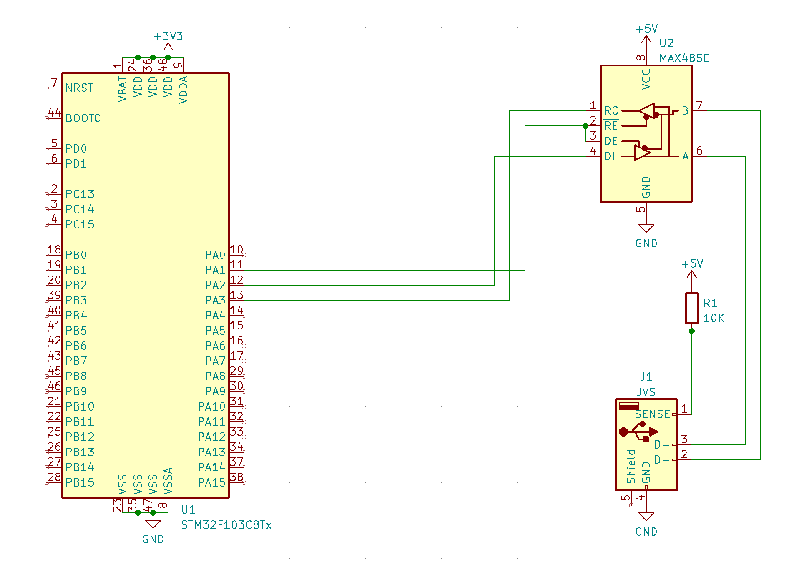

# JVSHostForSTM32F103C8Tx
An example project to implement JVS Host with jvsio on STM32F103C8Tx.

# Project Specific Code
## Configuration
- USART1_RX/USART1_TX: optional for debug logging.
- USART2_RX/USART2_TX: JVS communication ports, connected to an external RS-485.
- USART2_DIR(PA1): JVS communication port control, connected to an external RS-485.
- ADC1_IN5: JVS sense, with DMA transmission.

## Schematic

Here is a simple schematic that explains the external wiring. It omits the most
common parts on the STM32.

## jvs_host.{c|h}
Chip specific implementation to use the jvsio library.

## Required logic in main.c
Following calls are needed to run the jvs_host code.
```
JVS_HOST_Init()

while (1)
{
  JVS_HOST_Run();
}
```
Also, CubeMX should generate proper configuration code to set up everything correctly.

# How to build
## macOS
You will need `make` and `gcc` for arm-none-eabi. One of the easiest ways is to use `Brew` to install `make` and `arm-none-eabi-gcc`.
```
$ brew tap ArmMbed/homebrew-formulae
$ brew install make arm-none-eabi-gcc
$ git clone https://github.com/toyoshim/JVSHostForSTM32F103C8Tx.git
$ cd JVSHostForSTM32F103C8Tx 
$ git submodule update --init
$ make
```

## Windows
Using WSL and follwing the process for Debian/Ubuntu is the easist way.

## Debian/Ubuntu
```
$ apt install make gcc-arm-none-eabi
$ git clone https://github.com/toyoshim/JVSHostForSTM32F103C8Tx.git
$ cd JVSHostForSTM32F103C8Tx 
$ git submodule update --init
$ make
```
